<!-- HEADER SECTION -->
<h5 align="center" style="padding:0;margin:0;">Mariné du Plessis</h5>
<h5 align="center" style="padding:0;margin:0;">221326</h5>
<h6 align="center">Interactive Development 300</h6>
 

  <a href="https://github.com/username/projectname">
    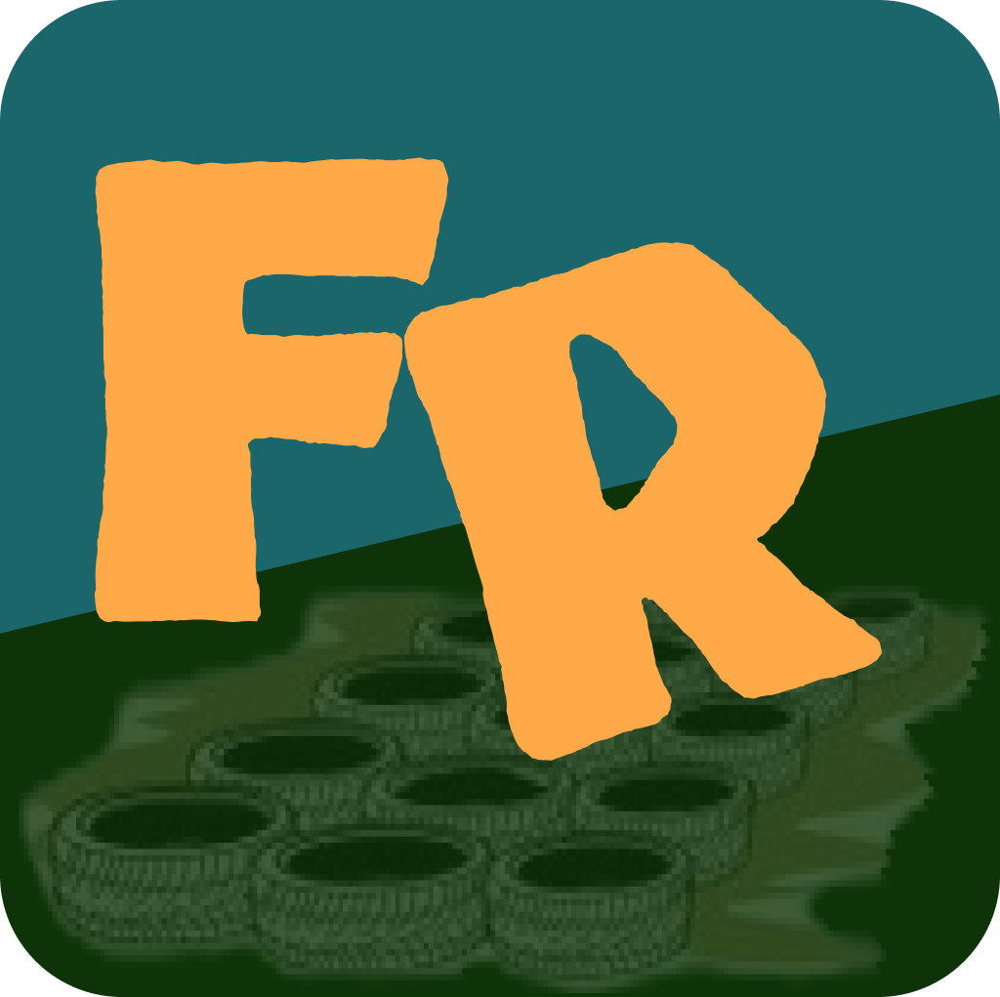
  </a>
  
  <h3 align="center">FunRun</h3>

  

    Your one stop to any obstacle course!  
      <a href="https://github.com/DupieM/duplessismarine_221326_funrun"><strong>Explore the docs »</strong></a>
    
    
   <a href="path/to/demonstration/video">View Demo</a>
    ·
    <a href="https://github.com/username/projectname/issues">Report Bug</a>
    ·
    <a href="https://github.com/username/projectname/issues">Request Feature</a>

<!-- TABLE OF CONTENTS -->

## Table of Contents

* [About the Project](#about-the-project)
  * [Project Description](#project-description)
  * [Built With](#built-with)
* [Getting Started](#getting-started)
  * [Prerequisites](#prerequisites)
  * [How to install](#how-to-install)
* [Features and Functionality](#features-and-functionality)
* [Concept Process](#concept-process)
   * [Ideation](#ideation)
   * [Wireframes](#wireframes)
   * [User-flow](#user-flow)
* [Development Process](#development-process)
   * [Implementation Process](#implementation-process)
        * [Highlights](#highlights)
        * [Challenges](#challenges)
   * [Reviews and Testing](#peer-reviews)
        * [Feedback from Reviews](#feedback-from-reviews)
        * [Unit Tests](#unit-tests)
   * [Future Implementation](#peer-reviews)
* [Final Outcome](#final-outcome)
    * [Mockups](#mockups)
    * [Video Demonstration](#video-demonstration)
* [Conclusion](#conclusion)
* [Roadmap](#roadmap)
* [Contributing](#contributing)
* [License](#license)
* [Contact](#contact)
* [Acknowledgements](#acknowledgements)

<!--PROJECT DESCRIPTION-->

## About the Project

<!-- header image of project -->

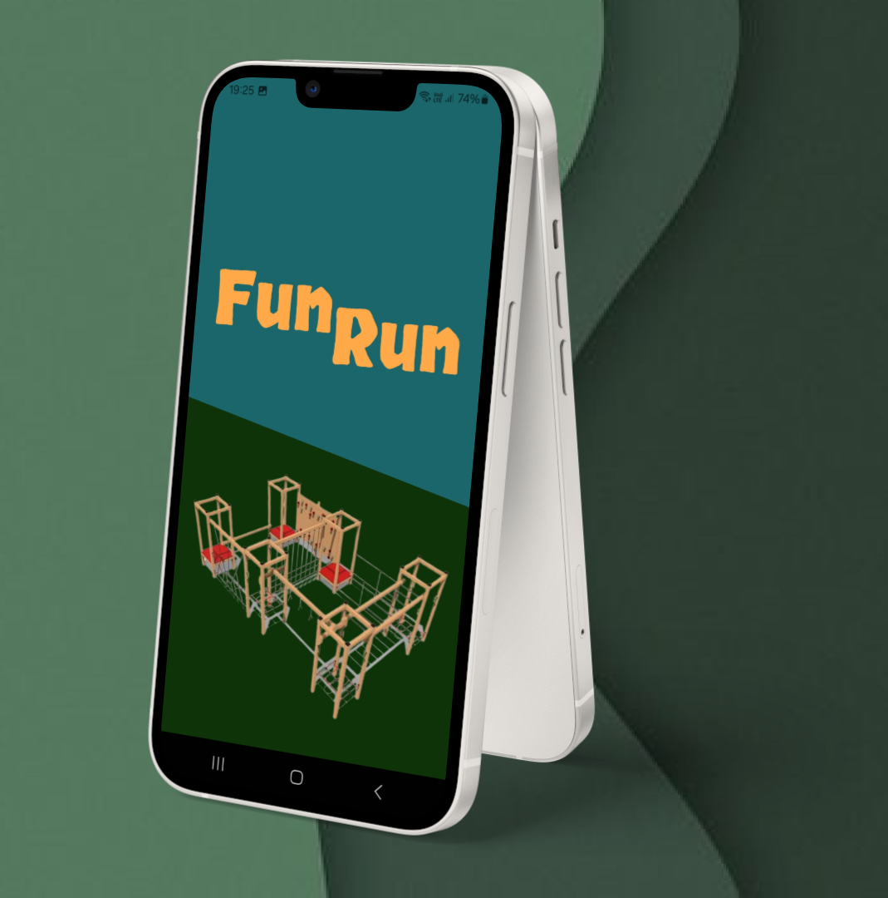

### Project Description

This term we were tasked to create and conceptualise a mobile application for any sort of competition of our choosing.
This application will consist of front-end and back-end requirements, as to host a physical competition. The mobile application I am creating will host obstacle courses for contestants to join and be able to win by achieving the fastest time.

### Built With

* 
* 
* 
* 
* 

<!-- GETTING STARTED -->
<!-- Make sure to add appropriate information about what prerequesite technologies the user would need and also the steps to install your project on their own mashines -->

## Getting Started

The following instructions will get you a copy of the project up and running on your local machine for development and testing purposes.

### Prerequisites

Ensure that you have the latest version of [Expo](https://docs.expo.dev/get-started/create-a-project/) installed on your machine. The Expo app for a mobile phone will also be required.

### How to install

### Installation
Clone the project repository as follow:

1. Go to Github Desktop and then click on clone new repository

2. Enter `https://github.com/DupieM/duplessismarine_221326_funrun.git` into the URL field and press the `Clone` button.

To start the Expo app and install dependancies on laptop:

1.  Go to Visual Studio code   
   Open your Visual Studio code then click on File and then click on Open folder.
    Then navigate to where you have cloned the repository and open it.

2.  Start terminal  
   Go to 'Terminal' then click on new terminal.

3.  Install dependencies  
   Enter 'npm install' to get all the dependencies

3.  Install latest Expo version  
   Enter 'npm install expo@latest' to get latest version

3.  Start the Expo server  
   Enter 'npm start' to start Expo

To start the Expo app on a phone:

1.  Go to Google play store or Apple play store   
   Open your plays tore and type in search field 'Expo Go'.
   Click on the Expo Go app and then install it.

2.  Open Expo Go app  
   After opening the app click on QR code and scan the QR code in the terminal of the app on Visual Studio

3. Start experimenting with the mobile application

<!-- FEATURES AND FUNCTIONALITY-->
<!-- You can add the links to all of your imagery at the bottom of the file as references -->

## Features and Functionality

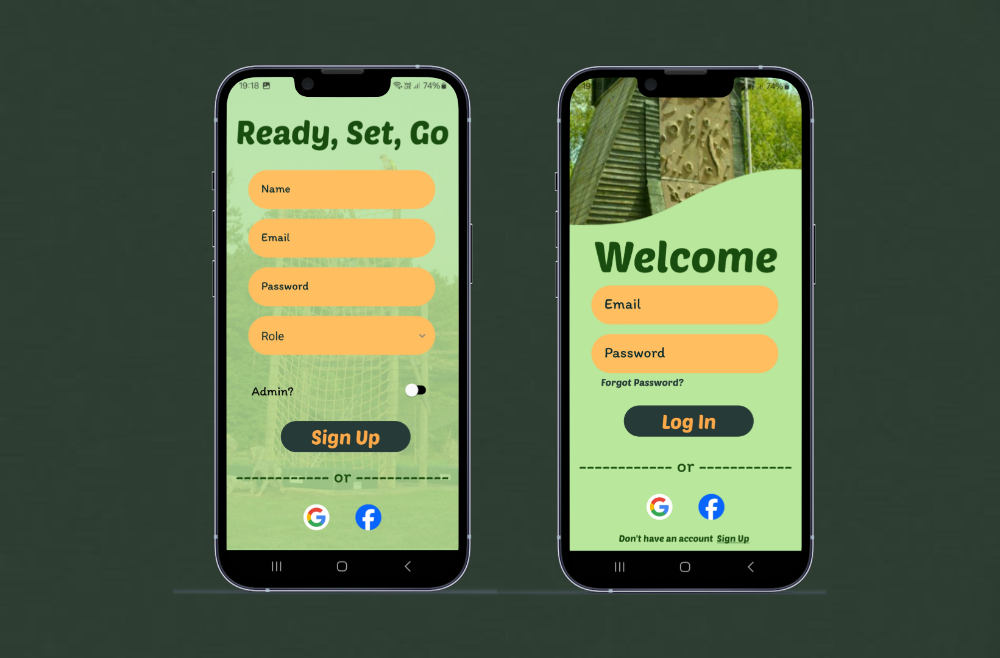
### Authentication

The authentication is role-based so a user will indicate if they Sign Up if they are a Contestant (taking part in the obstacle course) or a Marshall (judge the contestant per specific course). A user can also create a user on the app or log in with their Google or Facebook account. During Log In the user will be authenticated and depending on their role will see different navigation bars.

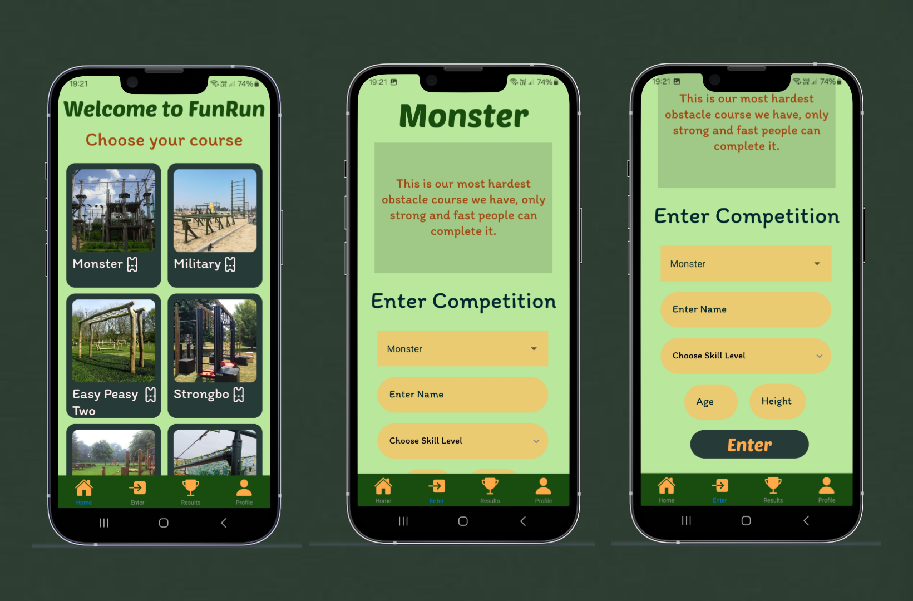
### View and Enter a Competition

Users are able to view all ten of the obstacle courses that ranges from exstreme difficult to very easy. Somne of the obstacle courses are made only for training of new beginners. A user can after clicking on a course view the detail about that course and will be able to enter it by filling in the necessary details and also choosing their skill level. 

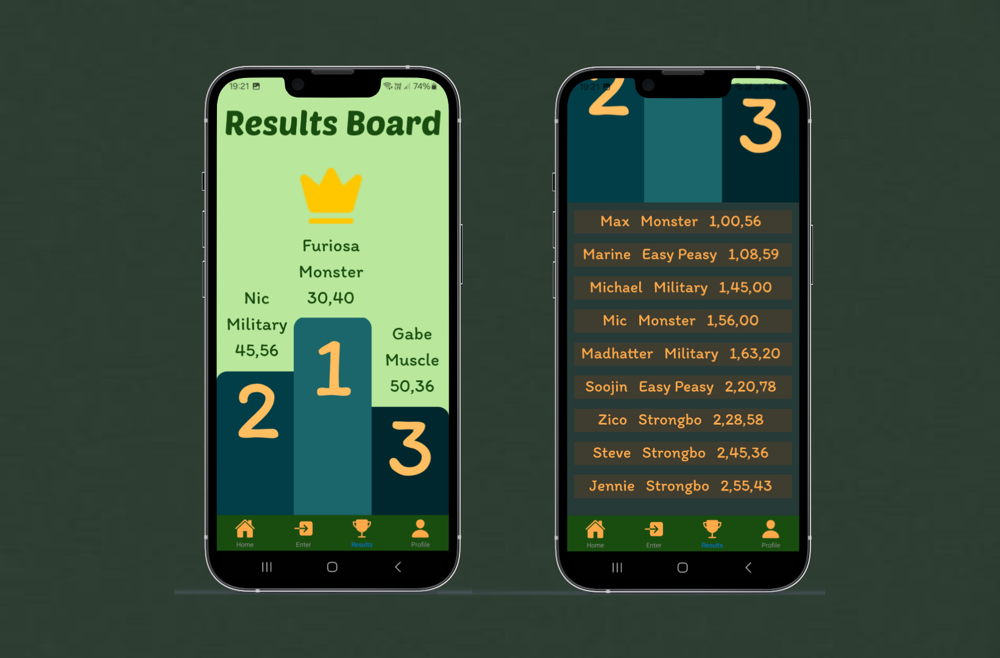
### View results 

Users will be able to see the results from all the the different obstacle course and they will also be able to see the Top 3 overall. Below the Top 3 all the rest of the contestants results can be seen in ascending order of course duration.

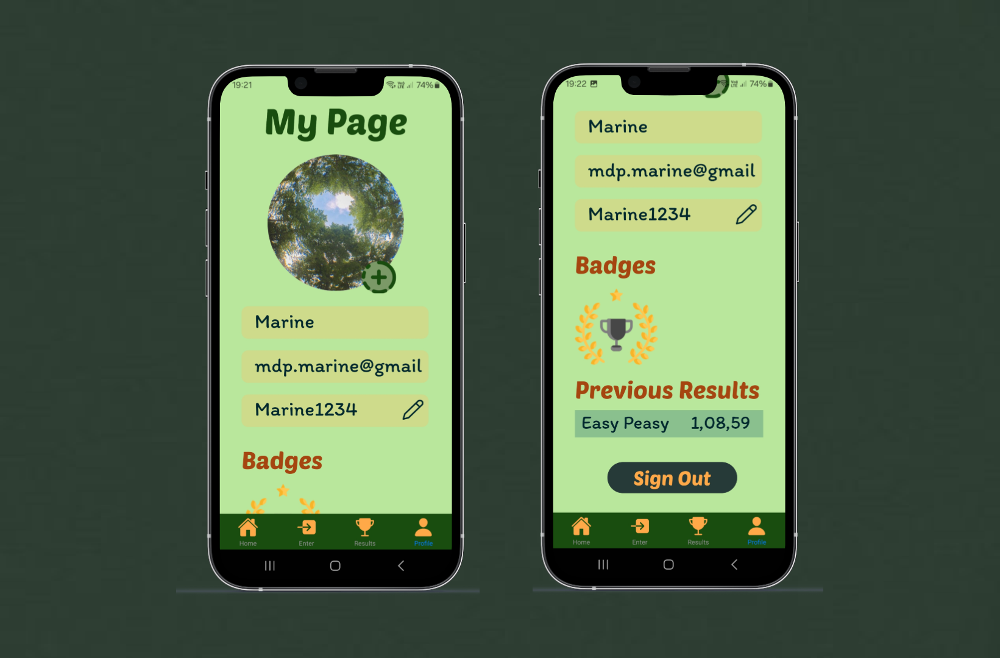
### Profile Page

User are able to view all their sign up information. In addition they will see their previous results.

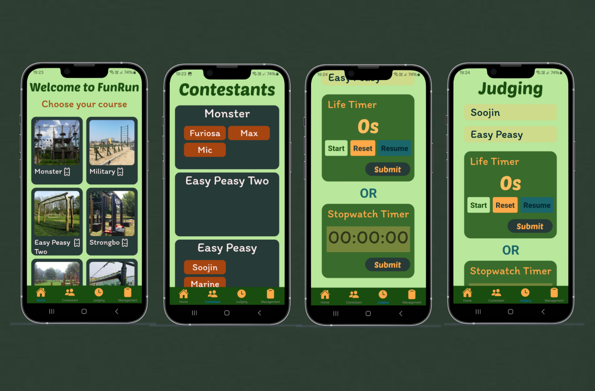
### Competition Judging

A marshall will be able to view all contestants that entered per course. The marshall can then click on a contestant name as to be able to judge the contestant on the next screen. The marshall can then choose to then either use the life timer or enter the time from a stopwatch. On the life timer the marshall will be able to start the timer, pause the timer or reset the timer.

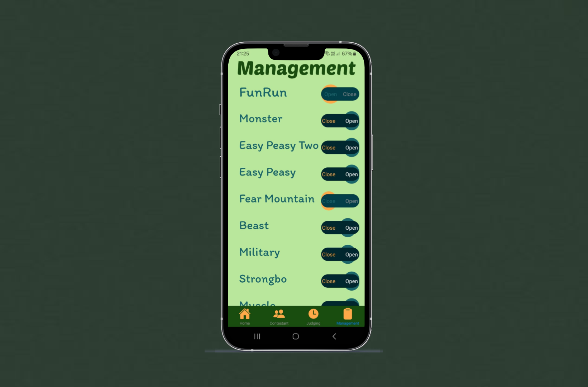
### Obstacle Course Management

A marshall will be able to change the availability of a course with a toggle. 

<!-- CONCEPT PROCESS -->
<!-- Briefly explain your concept ideation process -->

## Concept Process

### Ideation

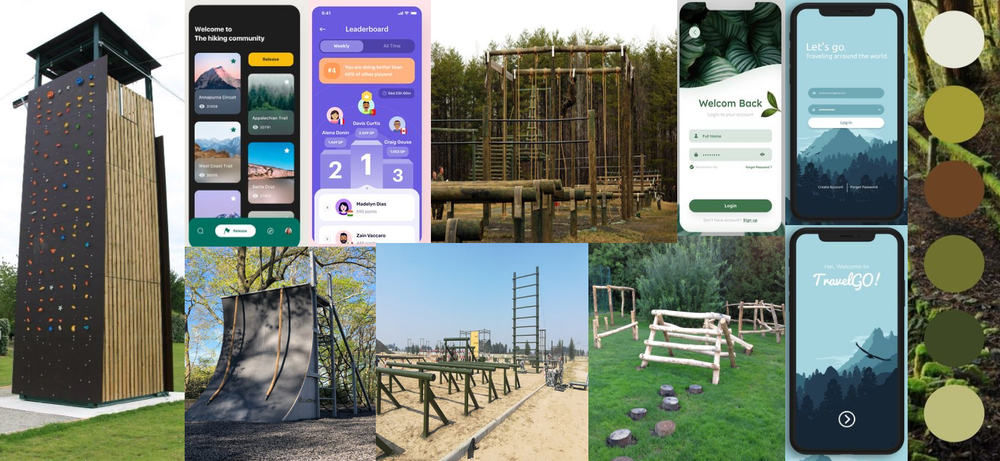

### Wireframes

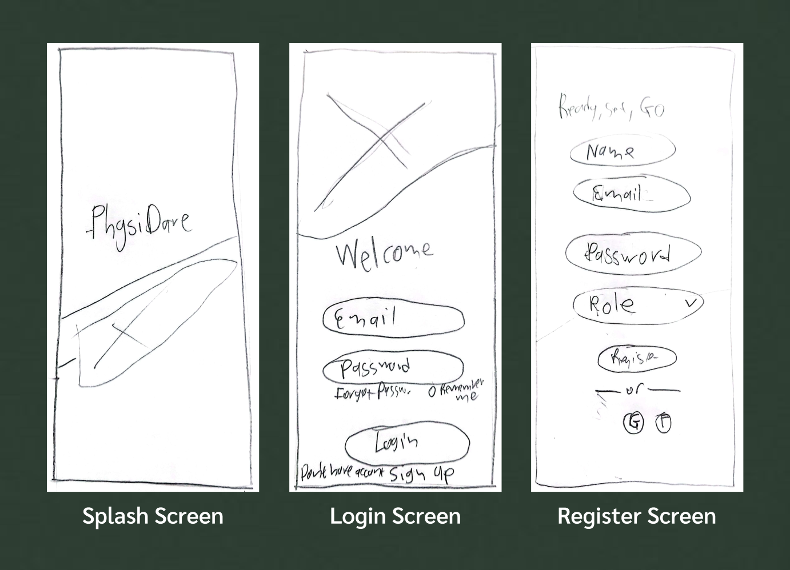
 
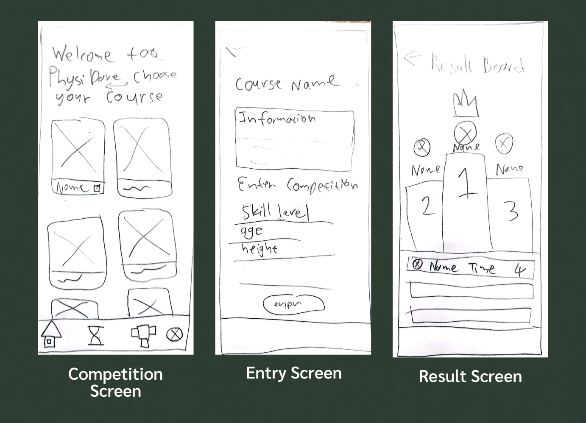
 
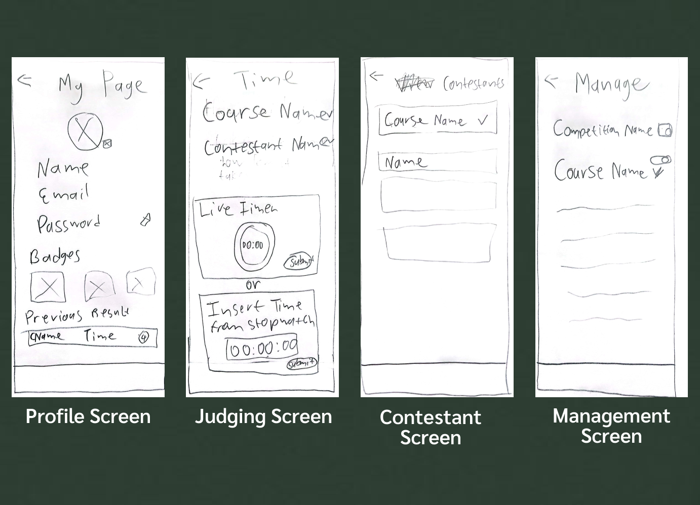

### ER-Diagram

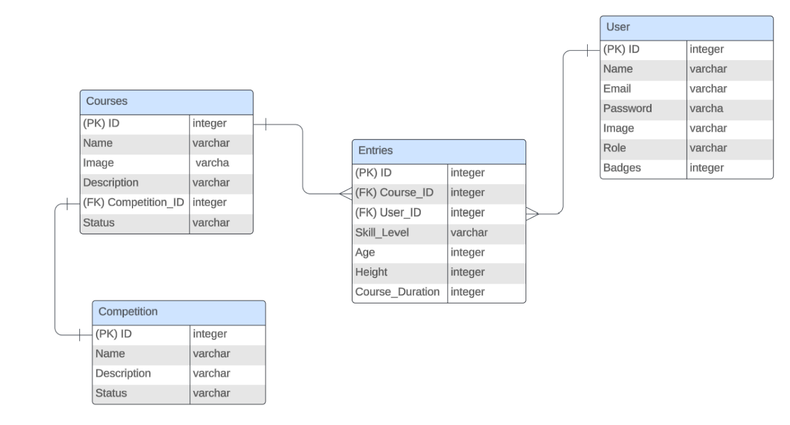

<!-- DEVELOPMENT PROCESS -->

## Development Process

The `Development Process` is the technical implementations and functionality done in the frontend and backend of the application.

### Implementation Process

<!-- stipulate all of the functionality you included in the project -->

* `Expo` was used to create a native Android app
* `GoogleAuthProvider` was used to enable signing in with a Google Account
* `Life Timer` was coded to be a function as to enable a life timer

#### Highlights

<!-- stipulated the highlight you experienced with the project -->

* To be able to work natively on my computer and seeing the results on the phone application

#### Challenges

<!-- stipulated the challenges you faced with the project and why you think you faced it or how you think you'll solve it (if not solved) -->

* Implementing the role-based authentication for the different types of users
* Figuring out how to display the resluts on the Top 3 podium 
* Creating a subcollection for the entries under each specific course
* Implementing the Google Account authentication as it seems React Native do not fully support it

### Reviews & Testing

<!-- stipulate how you've conducted testing in the form of peer reviews, feedback and also functionality testing, like unit tests (if applicable) -->

#### Reviews

`Stand Ups` were conducted throug out the project where feedback was received and implemented as suggested

#### Unit Tests

`Unit Tests` were conducted to establish working functionality. Here are all the tests that were ran:

* Test 1 for Authentication to make sure that username and password validation works and that the sign in is roled based
* Test 2 for Viewing all the courses on the home page
* Test 3 for Entering a specific course and creating a subcollection of it in Firebase
* Test 4 for Displaying all the results over all courses on the Top 3 podium and the rest below it from lowest to higest time
* Test 5 for Displaying the course in a card and adding the contestants that entered inside of the specific course card
* Test 6 for A Marshall to select the contestant that he wants to time for
* Test 7 for Entering the time either by life timer or enter manualy from stopwatch

### Future Implementation

<!-- stipulate functionality and improvements that can be implemented in the future. -->

* Enhancing the ability to manage the competition and courses
* Creating functionality to allow for badges to be assigned for different actions on the app

<!-- MOCKUPS -->
## Final Outcome

### Mockups

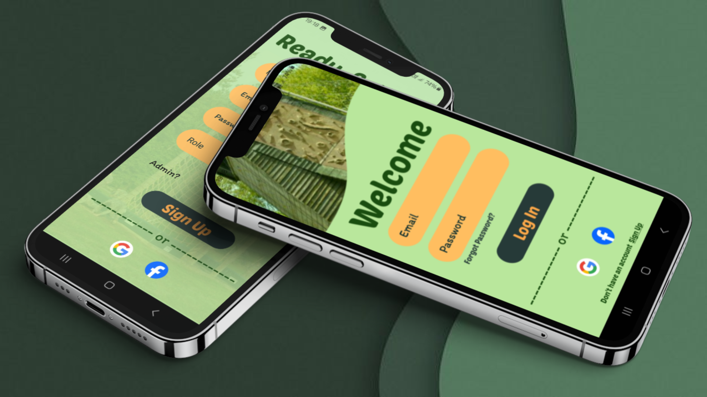
 
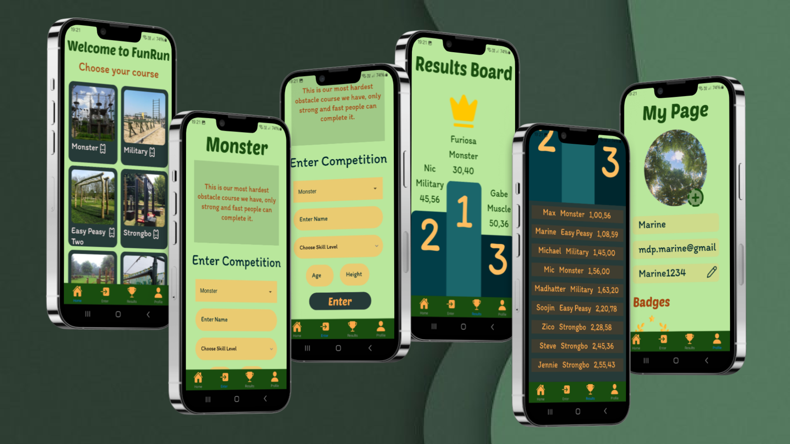
 
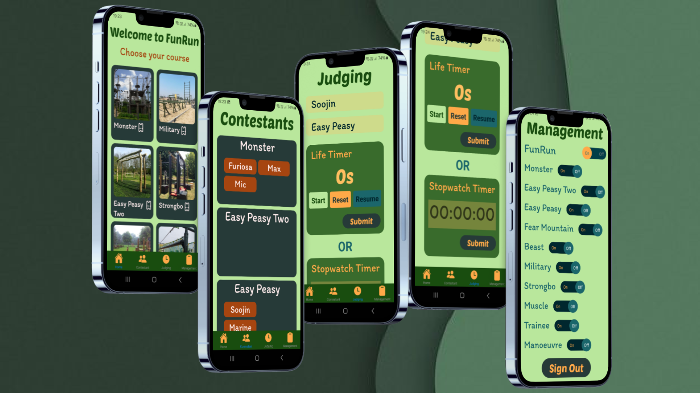

<!-- VIDEO DEMONSTRATION -->

### Video Demonstration

To see a run through of the application, click below:

[View Demonstration](https://drive.google.com/file/d/11IBTSpQxcS-qFlAkhB16VvUcIO3taRav/view?usp=sharing)

<!-- ROADMAP -->

## Roadmap

See Future Implementation for a list of proposed features (and known issues).

<!-- CONTRIBUTING -->

## Contributing

Contributions are what makes the open-source community such an amazing place to learn, inspire, and create. Any contributions you make are **greatly appreciated**.

1. Fork the Project
2. Create your Feature Branch (`git checkout -b feature/AmazingFeature`)
3. Commit your Changes (`git commit -m 'Add some AmazingFeature'`)
4. Push to the Branch (`git push origin feature/AmazingFeature`)
5. Open a Pull Request

<!-- AUTHORS -->

## Authors

* **Mariné du Plessis** - [username](https://github.com/DupieM)

<!-- LICENSE -->

## License

Rights reserved © 2024

<!-- LICENSE -->

## Contact

* **Mariné du Plessis** - [email@address](221326@virtualwindow.co.za) 
* **Project Link** - https://github.com/DupieM/duplessismarine_221326_funrun?tab=readme-ov-file

<!-- ACKNOWLEDGEMENTS -->

## Acknowledgements
<!-- all resources that you used and Acknowledgements here -->
* [Expo Documentation](https://docs.expo.dev/)
* [Firebase Documentation](https://firebase.google.com/docs?hl=en&authuser=1&_gl=1*oj3ulf*_ga*MTQzMDEzOTU3OS4xNzEyNTU2NTU1*_ga_CW55HF8NVT*MTcxODU1NTAxMS44NS4xLjE3MTg1NTgxMDAuNTkuMC4w)
* [Geek for Geeks](https://www.geeksforgeeks.org/create-a-stop-watch-using-react-native/)
